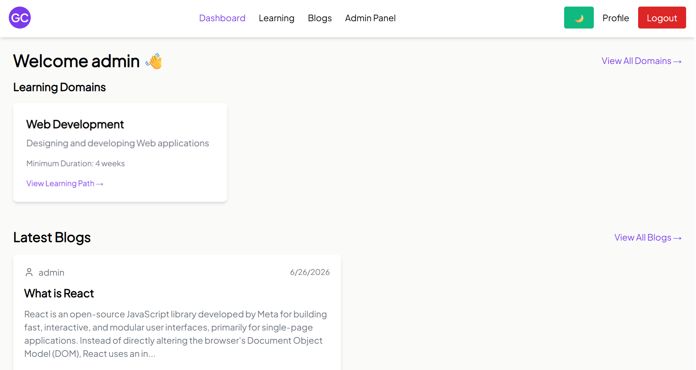
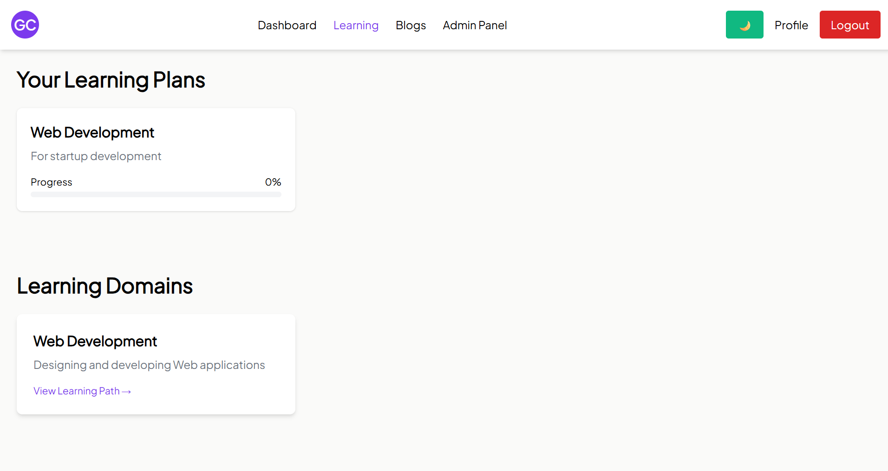
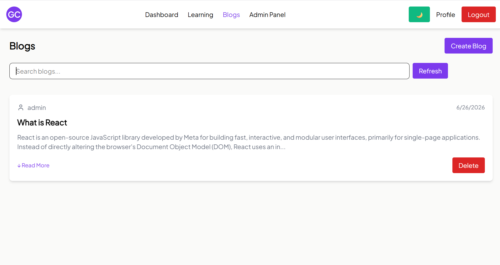
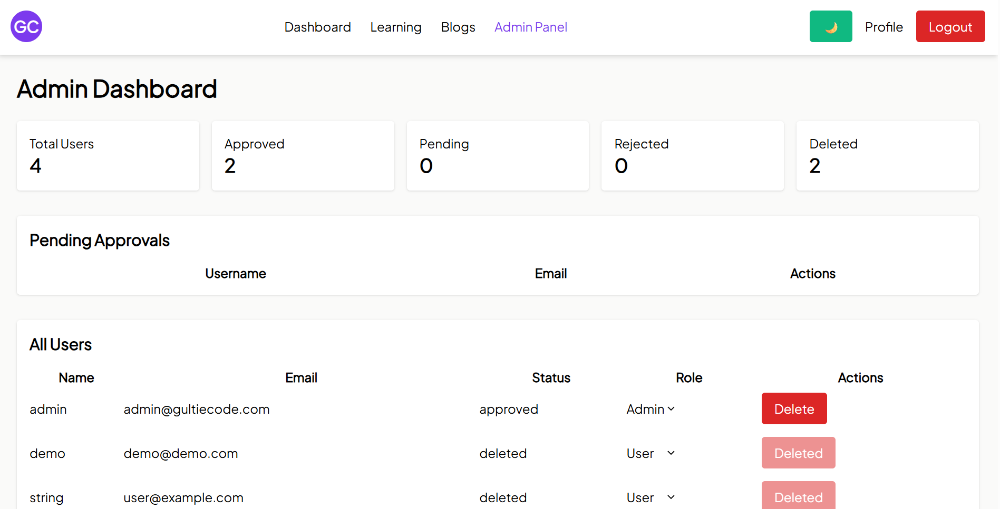

# Gultie Code

> **AI-Powered Learning Platform**

Gultie Code is a full-stack learning platform that enables users to explore various technology domains, read technical blogs, interact with the community through comments, and generate personalized AI-powered learning roadmaps tailored to their goals and available study time.

---

## 📖 Table of Contents

* [Tech Stack](#-tech-stack)
* [Architecture](#-architecture)
* [Project Structure](#-project-structure)
* [Application Screenshots](#-application-screenshots)
* [Running the Application](#-running-the-application)

  * [Option 1: Docker](#option-1-run-using-docker-recommended)
  * [Option 2: Manual Setup](#option-2-run-manually)
* [Environment Variables](#-environment-variables)
* [Database Migration](#-database-migration)
* [API Documentation](#-api-documentation)
* [Future Enhancements](#-future-enhancements)

---

# 🛠 Tech Stack

## Frontend

* React
* TypeScript
* Vite
* Tailwind CSS
* React Router
* Context API

---

## Backend

* FastAPI
* SQLAlchemy ORM
* Alembic
* PostgreSQL
* Pydantic
* JWT Authentication

---

## AI

* Google Gemini API

---

## DevOps

* Docker
* Docker Compose

---

# 🏗 Architecture

```text
                +---------------------+
                |      React UI       |
                +----------+----------+
                           |
                           |
                      REST API
                           |
                           |
                +----------v----------+
                |      FastAPI        |
                +----------+----------+
                           |
          ------------------------------
          |                            |
          |                            |
+---------v---------+        +---------v---------+
|    PostgreSQL     |        |   Google Gemini   |
+-------------------+        +-------------------+
```

---

# 📂 Project Structure

```text
Gultie Code
│
├── gultie-code                # React Frontend
│
├── gultie-code-backend        # FastAPI Backend
│
├── docker-compose.yml
│
└── README.md
```

---

# 📸 Application Screenshots

## Dashboard

> 

---

## Learning Page

> 

---

## Blog Module

> 

---

## Admin Panel

> 

---

# 🚀 Running the Application

# Option 1: Run Using Docker (Recommended)

## Prerequisites

* Docker Desktop
* Docker Compose

---

### Clone Repository

```bash
git clone <repository-url>

cd "Gultie Code"
```

---

### Create Environment Files

Frontend

```
gultie-code/.env
```

Backend

```
gultie-code-backend/.env
```

Configure all required [environment variables](#env).

---

### Build Containers

```bash
docker compose build
```

---

### Start Containers

```bash
docker compose up
```

or

```bash
docker compose up -d
```

---

### Stop Containers

```bash
docker compose down
```

---

### Stop and Remove Database Volume

```bash
docker compose down -v
```

> **Warning:** This removes all PostgreSQL data stored inside Docker.

---

### Access Application

Frontend

```
http://localhost:5173
```

Backend

```
http://localhost:8000
```

Swagger (Backend UI Access)

```
http://localhost:8000/docs
```

---

# Option 2: Run Manually

## 1. Start PostgreSQL

Ensure PostgreSQL service is running.

Open pgAdmin or your preferred database client (such as DBeaver or the psql terminal).

Connect to your PostgreSQL server using your username and password.

Create a new database named:

```
gultie_code_db
```

---

## 2. Backend

Navigate to backend directory

```bash
cd gultie-code-backend
```

Create Virtual Environment

```bash
python -m venv .myenv
```

Activate Environment

Windows

```bash
# Command Prompt (cmd)
.myenv\Scripts\activate.bat

# PowerShell
.myenv\Scripts\Activate.ps1
```

Install Dependencies

```bash
pip install -r requirements.txt
```

Run Alembic Migration

```bash
alembic upgrade head
```

Start Backend

```bash
uvicorn app.main:app --reload
```

Backend runs on

```
http://localhost:8000
```

---

## 3. Frontend

Navigate to frontend

```bash
cd gultie-code
```

Install Packages

```bash
npm install
```

Start Development Server

```bash
npm run dev
```

Frontend runs on

```
http://localhost:5173
```

---

# 🔑 Environment Variables

## Backend

Example

```
DB_PASSWORD (Your pg db password)
SECRET_KEY (A key of your own for jwt auth)
GEMINI_API_KEY (you will get from google AI studio)
```

---

## Frontend

Example

```
VITE_API_BASE_URL (it is your backend url)
```

---

# 🗄 Database Migration

Generate Migration

```bash
alembic revision --autogenerate -m "Migration Name"
```

Apply Migration

```bash
alembic upgrade head
```

Rollback

```bash
alembic downgrade -1
```

---

# 📘 API Documentation

Swagger UI

```
http://localhost:8000/docs
```

ReDoc

```
http://localhost:8000/redoc
```

---

# 🔮 Future Enhancements

* Learning Analytics Dashboard
* Coding Challenges
* Skill Assessments
* Leaderboards
* Team Learning
* Admin Dashboard
* Roadmap Sharing

---

# 👨‍💻 Developed By

**Siva Shankar Reddy Anubothula**

National Institute of Technology Rourkela

For suggestions or improvements contact [siva.anubothula@gmail.com](mailto:siva.anubothula@gmail.com)

---

## ⭐ If you found this project useful, consider giving it a star!
